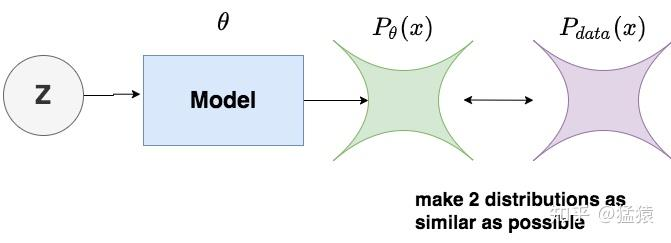

扩散模型(Diffusion Model)系列：基石 DDPM (数学原理篇)

----
> 时间：2024-05-10  ·   地点：宁德时代科技楼    ·   作者：余欢
> 内容：扩散模型基础知识之 DDPM 模型

# Reference
> * [深入浅出扩散模型(Diffusion Model)系列：基石DDPM（模型架构篇），最详细的DDPM架构图解](https://zhuanlan.zhihu.com/p/637815071)

# 0.前言 
本篇将解读扩散模型的基石：DDPM(Denoising Diffusion Probalistic Models)。扩散模型的研究并不始于 DDPM，但 DDPM 的成功对扩散模型的发展起到至关重要的作用。在这个系列里我们也会看到，后续一连串效果惊艳的模型，都是在 DDPM 的框架上迭代改进而来。所以，我把 DDPM 放在这个系列的第一篇进行讲解。

针对这些痛点，DDPM系列将会出如下三篇文章：
1. [DDPM(模型架构篇)](DDPM_模型架构篇.md)：在阅读源码的基础上，本篇绘制了详细的DDPM模型架构图（DDPM UNet），同时附上关于模型运作流程的详细解说。本篇不涉及数学知识，直观帮助大家了解DDPM怎么用，为什么好用。
2. [DDPM(数学原理篇)](./DDPM_数学原理篇.md)：也就是本篇文章，DDPM的数学推理可能是很多读者头疼的部分。我尝试跳出原始论文的推导顺序和思路，从更符合大家思维模式的角度入手，把整个推理流程串成一条完整的逻辑线。同样，我也会配上大量的图例，方便大家理解数学公式。如果你不擅长数学推导，这篇文章可以帮助你从直觉上了解DDPM的数学有效性；如果你更关注推导细节，这篇文章中也有详细的推导中间步骤。
3. [DDPM(源码解读篇)](./DDPM_源码解读篇.md)：在前两篇的基础上，我们将配合模型架构图，一起阅读DDPM源码，并实操跑一次，观测训练过程里的中间结果。

# 1.DDPM 在做一件什么事
**DDPM 的本质作用，就是学习训练数据的分布，产出尽可能符合训练数据分布的真实图片。** 所以，它也成为后续文生图类扩散模型框架的基石。

# 2.优化目标
现在，我们知道DDPM的目标就是：**使得生成的图片尽可能符合训练数据分布**。基于这个目标，我们记：
* $P_{\theta}(x)$ ：模型所产生的图片的（概率）分布。其中 $\theta$ 表示模型参数，以 $\theta$ 作为下标的目的是表示这个分布是由模型决定的；
* $P_{data}(x)$：训练数据（也可理解为真实世界）图片的（概率）分布。下标 $data$ 表示这是一个自然世界客观存在的分布，与模型无关。
  
则我们的优化目标可以用图例表示为：

    
     
    
DDPM 优化目标

而求两个分布之间的相似性，我们自然而然想到了 $KL散度$ 。复习一下 $KL散度$ 的定义：分布 $p$与分布 $q$之间的 $KL散度$ 为：
$$
\begin{align}
    D_{KL}(p\mid\mid q) &= \sum_{i=1}^{m}p(x_i)\log{\frac{p(x_i)}{q(x_i)}} \tag{原始定义}\\
    &= -\sum_{i=1}^{m}p(x_i)\log{\frac{q(x_i)}{p(x_i)}} \tag{稍作变化} \\
    &= -\int_{x} p(x)\log{\frac{q(x)}{p(x)}}dx(m\rightarrow\infty) \tag*{公式1}
\end{align}
$$
则现在我们的目标函数就变为：
$$\underset{\theta}{argmin}KL(P_{data}||P_\theta) \tag{目标函数}$$
我们利用利用 $公式1$，对该目标函数做一些变换:
$$
\begin{align}
    \underset{\theta}{argmin}KL(P_{data}||P_\theta) &=  \underset{\theta}{argmin}-\int_xP_{data}(x)\log{\frac{P_\theta(x)}{P_{data}(x)}}dx \tag*{} \\
    &= \underset{\theta}{argmax}\int_xP_{data}(x)\log{\frac{P_\theta(x)}{P_{data}(x)}}dx \tag*{} \\
    &= \underset{\theta}{argmax}\int_xP_{data}(x)\log{P_\theta(x)}dx -  \underset{\theta}{argmax}\int_xP_{data}(x)\log{P_{tata}(x)}dx \tag{第二项式常数项，与模型无关} \\
    &= \underset{\theta}{argmax}\int_xP_{data}(x)\log{P_\theta(x)}dx \tag*{} \\
    &= \underset{\theta}{argmax}E_{x \sim P_{data}}[\log{P_\theta(x)}] \tag*{} \\
    &\approx \underset{\theta}{argmax}\sum_{i=1}^{m}\log{P_\theta(x_i)} \tag{从真实世界中抽取 m 个样本} \\
    &= \underset{\theta}{argmax}\log{\prod_{i=1}^{m}P_\theta(x_i)} \tag*{} \\
    &= \underset{\theta}{argmax}\prod_{i=1}^{m}P_\theta(x_i) \tag{公式2}
\end{align}
$$

经过这一番转换，我们的优化目标从直觉上的 “令模型输出的分布逼近真实图片分布” 转变为“  $\underset{\theta}{argmax}\prod_{i=1}^{m}P_\theta(x_i)$"，我们也可以把这个新的目标函数通俗理解成“使得模型产生真实图片的概率最大”。如果一上来就直接把式(2)作为优化目标，可能会令很多朋友感到困惑。因此在这一步中，我们解释了为什么要用式(2)作为优化目标。