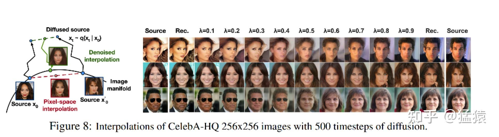
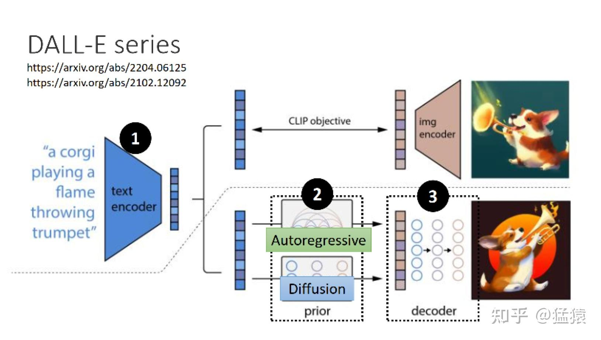

扩散模型(Diffusion Model)系列：基石 DDPM (模型架构篇)

# Reference
> * [PPDM: Denoise Diffusion Probabilistic Model](./f-files/Denoising Diffusion Probabilistic Models.pdf)
> * [深入浅出扩散模型(Diffusion Model)系列：基石DDPM（模型架构篇），最详细的DDPM架构图解](https://zhuanlan.zhihu.com/p/637815071)

# 0.前言 
本篇将解读扩散模型的基石：DDPM(Denoising Diffusion Probalistic Models)。扩散模型的研究并不始于 DDPM，但 DDPM 的成功对扩散模型的发展起到至关重要的作用。在这个系列里我们也会看到，后续一连串效果惊艳的模型，都是在 DDPM 的框架上迭代改进而来。所以，我把 DDPM 放在这个系列的第一篇进行讲解。

针对这些痛点，DDPM系列将会出如下三篇文章：
1. [DDPM(模型架构篇)](DDPM_模型架构篇.md)：在阅读源码的基础上，本篇绘制了详细的DDPM模型架构图（DDPM UNet），同时附上关于模型运作流程的详细解说。本篇不涉及数学知识，直观帮助大家了解DDPM怎么用，为什么好用。
2. [DDPM(数学原理篇)](./DDPM_数学原理篇.md)：也就是本篇文章，DDPM的数学推理可能是很多读者头疼的部分。我尝试跳出原始论文的推导顺序和思路，从更符合大家思维模式的角度入手，把整个推理流程串成一条完整的逻辑线。同样，我也会配上大量的图例，方便大家理解数学公式。如果你不擅长数学推导，这篇文章可以帮助你从直觉上了解DDPM的数学有效性；如果你更关注推导细节，这篇文章中也有详细的推导中间步骤。
3. [DDPM(源码解读篇)](./DDPM_源码解读篇.md)：在前两篇的基础上，我们将配合模型架构图，一起阅读DDPM源码，并实操跑一次，观测训练过程里的中间结果。

# 1.DDPM 在做一件什么事
假设你想做一个以文生图的模型，你的目的是给一段文字，再随便给一张图(比如一张噪声)，这个模型能帮你产出符合文字描述的逼真图片，例如：

    
     
    
文生图

文字描述就像是一个指引(guidance)，帮助模型去产生更符合语义信息的图片。但是，毕竟语义学习是复杂的。我们能不能先退一步，先让模型拥有产生逼真图片的能力？

比如说，你给模型喂一堆 cyberpunk 风格的图片，让模型学会 cyberpunk 风格的分布信息，然后喂给模型一个随机噪音，就能让模型产生一张逼真的 cyberpunk 照片。或者给模型喂一堆人脸图片，让模型产生一张逼真的人脸。同样，我们也能选择给训练好的模型喂带点信息的图片，比如一张夹杂噪音的人脸，让模型帮我们去噪:

    
     
    
生成逼真的图片

为了产出逼真图片的能力，模型可能在下一步中去学习语义信息(guidance)，进一步产生符合人类意图的图片。而 **DDPM 的本质作用，就是学习训练数据的分布**，产出尽可能符合训练数据分布的真实图片。所以，它也成为后续文生图类扩散模型框架的基石。

# 2.DDPM 训练流程
理解 DDPM 的目的，及其对后续文生图的模型的影响，现在我们可以更好来理解 DDPM 的训练过程了。总体来说，DDPM的训练过程分为两步：
> * Diffusion Process(又被称为 Forward Process)
> * Denoise Process(又被称为 Reverse Process）

前面说过，**DDPM 的目的是要去学习训练数据的分布**，然后产出和训练数据分布相似的图片。那怎么“迫使”模型去学习呢？

一个简单的想法是，我拿一张干净的图，每一步(timestep)都往上加一点噪音，然后在每一步里，我都让模型去找到加噪前图片的样子，也就是让模型学会去噪。这样训练完毕后，我再塞给模型一个纯噪声，它不就能一步步帮我还原出原始图片的分布了吗？

一步步加噪的过程，就被称为 Diffusion Process；一步步去噪的过程，就被称为 Denoise Process。

## 2.1 Diffusion Process
Diffusion Process 的命名受到热力学中分子扩散的启发：分子从高浓度区域扩散至低浓度区域，直至整个系统处于平衡。加噪过程也是同理，每次往图片上增加一些噪声，直至图片变为一个纯噪声为止。整个过程如下：

    
     
    
添加噪声的过程(Diffusion Process)

如上图所示，我们进行了 1000 步的加噪，每一步我们都往图片上加入一个高斯分布的噪声，直到图片变为一个纯高斯分布的噪声。记：
> * $T$：总步数；
> * $x_0,x_1,...,x_T$：每一步产生的图片。其中 $x_0$ 为原始图片，$x_T$ 为纯高斯噪声；
> * $\epsilon \sim \Nu(0,I)$：为每一步添加高斯噪声；
> * $q(x_t|x_{t-1})$：$x_t$ 在条件 $x = x_{t-1}$ 下的概率分布。

那么根据以上的流程图，有：$x_t = x_{t-1} + \epsilon = x_0 + \epsilon_0 + \epsilon_1 + ... + \epsilon$ 根据公式，为了知道 $x_t$，需要添加噪声好多次，不方便，需要简化。

### 2.1.1 重参数
我们知道随着步数的增加，图片中原始信息含量越少，噪声越多，我们可以分别给原始图片和噪声一个权重来计算 $x_t$：
> * $\bar{\alpha}_1, \bar{\alpha}_2,..., \bar{\alpha}_T$：一系列常数，类似于超参数，**随着 $T$ 的增加越来越小**。

则此时  的计算可以设计成：$x_t = \sqrt{\bar{\alpha}_t}*x_0 + \sqrt{1 - \bar{\alpha}_t}*\epsilon$。现在，我们只需要 sample 一次噪声，就可以直接从 $x_0$ 得到 $x_t$ 了。

接下来，我们再深入一些，其实 $\bar{\alpha}_1, \bar{\alpha}_2,..., \bar{\alpha}_T$ 并不是我们直接设定的超参数，它是根据其它超参数推导而来，这个“其它超参数”指：
> * $\beta_1, \beta_2,...,\beta_T$：一系列常数，是我们直接设定的超参数，**随着 $T$ 的增加越来越大**

$\bar{\alpha}$ 和 $\beta$ 的关系为：
> * $\alpha_t = 1 - \beta_t$
> * $\bar{\alpha}_t = \alpha_1\alpha_2...\alpha_t = (1-\beta_1)(1-\beta_2)...(1-\beta_t)$ 

这样从原始加噪到 $\beta$，$\alpha$ 加噪，再到 $\bar{\alpha}$ 加噪，使得 $q(x_t|x_{t-1})$ 转换成 $q(x_t|x_0)$ 的过程，就被称为重参数(Reparameterization)。我们会在这个系列的下一篇（数学推导篇）中进一步探索这样做的目的和可行性。在本篇中，大家只需要从直觉上理解它的作用方式即可。

## 2.2 Denoise Process
Denoise Process 的过程与 Diffusion Process 刚好相反：给定 $x_t$，让模型能把它还原到 $x_{t-1}$。在上文中我们曾用 $q(x_t|x_{t-1})$ 这个符号来表示加噪过程，这里我们用 $p(x_{t-1}|x_t)$ 来表示去噪过程。由于加噪过程只是按照设定好的超参数进行前向加噪，本身不经过模型。但去噪过程是真正训练并使用模型的过程。所以更进一步，我们用 $p_\theta(x_{t-1}|x_t)$ 来表示去噪过程，其中 $\theta$ 表示模型参数，即：
* $q(x_t|x_{t-1})$：用来表示 Diffusion Process
* $p_\theta(x_{t-1}|x_t)$：用来表示 Denoise Process。

讲完符号表示，我们来具体看去噪模型做了什么事。如下图所示，从第 $T$ 个 timestep 开始，模型的输入为 $x_t$ 与当前 $timestep\ t$  。模型中蕴含一个 **噪声预测器**(UNet)，它会根据当前的输入预测出噪声，然后，将当前图片减去预测出来的噪声，就可以得到去噪后的图片。重复这个过程，直到还原出原始图片 $x_0$ 为止：

    
     
    
添加噪声和去除噪声的过程

你可能想问：
* **为什么我们的输入中要包含 $timestep$ ?**
* 为什么通过预测噪声的方式，就能让模型学得训练数据的分布，进而产生逼真的图片？

第二个问题的答案我们同样放在下一篇(数学推理篇)中进行详解。而对于第一个问题，由于模型每一步的去噪都用的是同一个模型，所以我们必须告诉模型，现在进行的是哪一步去噪。因此我们要引入 $timestep$。

$timestep$ 的表达方法类似于 Transformer 中的位置编码([可以参考这篇文章](https://zhuanlan.zhihu.com/p/454482273))，将一个常数转换为一个向量，再和我们的输入图片进行相加。

注意到，UNet 模型是 DDPM 的核心架构，我们将关于它的介绍放在本文的第四部分。到这里为止，如果不考虑整个算法在数学上的有效性，我们已经能从直觉上理解扩散模型的运作流程了。那么，我们就可以对它的训练和推理过程来做进一步总结了。

# 3.DDPM 的 Training 与 Sampling 过程
## 3.1 Training

    
     
    
DDPM训练伪代码

上图给出了 DDPM 论文中对训练步骤的概述，我们来详细解读它。前面说过，DDPM 模型训练的目的，就是给定 $timestep$ 和输入图片，结合这两者去预测图片中的噪声。我们知道，在重参数的表达下，第 $t$ 个时刻的输入图片可以表示为：$x_t = \sqrt{\bar{\alpha}_t}*x_0 + \sqrt{1 - \bar{\alpha}_t}*\epsilon$

也就是说，第 $t$ 个时刻 $sample$ 出的噪声 $\epsilon \sim \Nu(0, I)$ ，就是我们的噪声真值。

> * 而我们 **预测出来的噪声** 为：$\epsilon_\theta(\sqrt{\bar{\alpha}_t}*x_0 + \sqrt{1 - \bar{\alpha}_t}*\epsilon, t)$ ，其中 $\theta$ 为模型参数，表示预测出的噪声和模型相关。
> * 那么易得出我们的 **loss** 为：$loss = \epsilon - \epsilon_\theta(\sqrt{\bar{\alpha}_t}*x_0 + \sqrt{1 - \bar{\alpha}_t}*\epsilon, t)$，我们只需要最小化该loss即可。

由于**不管对任何输入数据，不管对它的任何一步，模型在每一步做的都是去预测一个来自高斯分布的噪声**。因此，整个训练过程可以设置为：
* 从训练数据中，抽样出一条 $x_0$(即 $x_0 \sim q(x_0)$ )
* 随机抽样出一个 $timestep\ t$(即 $t \sim Uniform(1,2,...,T)$)
* 随机抽样出一个噪声$\epsilon$(即 $\epsilon \sim \Nu(0, I)$)
* 计算：$loss = \epsilon - \epsilon_\theta(\sqrt{\bar{\alpha}_t}*x_0 + \sqrt{1 - \bar{\alpha}_t}*\epsilon, t)$ 
* 计算梯度，更新模型，重复上面过程，直至收敛

上面演示的是单条数据计算 loss 的过程，当然，整个过程也可以在 batch 范围内做，batch 中单条数据计算 loss 的方法不变。

## 3.2 Sampleing

    
     
    
DDPM的Sampling伪代码

当DDPM训练好之后，我们要怎么用它，怎么评估它的效果呢？

对于训练好的模型，我们从最后一个时刻 $T$ 开始，传入一个纯噪声（或者是一张加了噪声的图片），逐步去噪。根据 $x_t = \sqrt{\bar{\alpha}_t}*x_0 + \sqrt{1 - \bar{\alpha}_t}*\epsilon$ ，我们可以进一步推出 $x_t$ 和 $x_{t-1}$ 的关系（上图的前半部分）。而 **图中 $\sigma_tz$ 一项，则不是直接推导而来的，是我们为了增加推理中的随机性，而额外增添的一项**。可以类比于 GPT 中为了增加回答的多样性，不是选择概率最大的那个 token，而是在 top-N 中再引入方法进行随机选择。

关于 $x_t$ 和 $x_{t-1}$ 关系的详细推导，我们也放在数学推理篇中做解释。

通过上述方式产生的 $x_0$ ，我们可以计算它和真实图片**分布之间的相似度(FID score：Frechet Inception Distance score)来评估图片的逼真性**。在 DDPM 论文中，还做了一些有趣的实验，例如通过“插值（interpolation）"方法，先对两张任意的真实图片做 Diffusion 过程，然后分别给它们的 diffusion 结果附不同的权重($\lambda$)，将两者diffusion结果加权相加后，再做 Denoise 流程，就可以得到一张很有意思的"混合人脸":

    
     
    
有趣实验: 加权Diffusion然后Denoise

# 4.去噪的核心模型：U-Net
UNet模型最早提出时，是用于解决医疗影像诊断问题的。总体上说，它分成两个部分：Encoder + Decoder

在 Encoder 部分中，UNet 模型会逐步压缩图片的大小；在 Decoder 部分中，则会逐步还原图片的大小。同时在 Encoder 和 Deocder 间，还会使用“残差连接”，确保 Decoder 部分在推理和还原图片信息时，不会丢失掉之前步骤的信息。整体过程示意图如下，因为压缩再放大的过程形似 "U" 字，因此被称为 UNet：

    

那么 DDPM 中的 UNet，到底长什么样子呢？我们假设输入为一张 $32*32*3$ 大小的图片，来看一下DDPM UNet运作的完整流程：

    
     
    
DDPM UNet运作的完整流程

## 4.1 DownBlock和UpBlock

    
     
    
DownBlock 和 UpBlock

如果你曾在学习 DDPM 的过程中，困惑 time embedding 要如何与图片相加，Attention 要在哪里做，那么这张图可以帮助你解答这些困惑。TimeEmbedding 层采用和 Transformer 一致的三角函数位置编码，将常数转变为向量。Attention 层则是沿着 channel 维度将图片拆分为 token，做完attention 后再重新组装成图片(注意 Attention 层不是必须的，是可选的，可以根据需要选择要不要上 Attention)。

需要关注的是，虚线部分即为“残差连接”（Residual Connection），而残差连接之上引入的虚线框Conv 的意思是，如果 $in\_c \neq out\_c$，则对 $in\_c$ 做一次卷积，使得其通道数等于 $out\_c$ 后，再相加；否则将直接相加。

你可能想问：一定要沿着 channel 方向拆分图片为 token 吗？我可以选择 VIT 那样以 patch 维度拆分 token，节省计算量吗？当然没问题，你可以做各种实验，这只是提供 DDPM 对图片做 Attention 的一种方法。

## 4.2 DownSample 和 UpSample
这个模块很简单，就是压缩(Conv)和放大(ConvT)图片的过程。对ConvT原理不熟悉的朋友们，可以参考[这篇](https://blog.csdn.net/sinat_29957455/article/details/85558870)文章。

    
     
    
DownSample 和 UpSample

## 4.3 MiddleBlock
和 DownBlock 与 UpBlock 的过程相似，不再赘述。
这个模块很简单，就是压缩(Conv)和放大(ConvT)图片的过程。对ConvT原理不熟悉的朋友们，可以参考[这篇](https://blog.csdn.net/sinat_29957455/article/details/85558870)文章。

    
     
    
MiddleBlock

# 5.文生图模型的一般公式
讲完了DDPM，让我们再回到开头，看看最初我们想训练的那个“以文生图”模型吧！

当我们拥有了能够产生逼真图片的模型后，我们现在能进一步用文字信息去引导它产生符合我们意图的模型了。通常来说，文生图模型遵循以下公式（图片来自李宏毅老师课堂PPT）：
* Text Encoder: 一个能对输入文字做语义解析的 Encoder，一般是一个预训练好的模型。在实际应用中，CLIP 模型由于在训练过程中采用了图像和文字的对比学习，使得学得的文字特征对图像更加具有鲁棒性，因此它的 text encoder 常被直接用来做文生图模型的 text encoder(比如DALLE2)
* Generation Model： 输入为文字 token 和图片噪声，输出为一个关于图片的压缩产物(latent space)。这里通常指的就是扩散模型，采用文字作为引导(guidance)的扩散模型原理，我们将在这个系列的后文中出讲解。
* Decoder：用图片的中间产物作为输入，产出最终的图片。Decoder 的选择也有很多，同样也能用一个扩散模型作为 Decoder。

|DALLE2|Stable Diffusion|Imagen|
|----|----|----|
||||
|它曾尝试用Autoregressive和Diffusion分别来做Generation Model，但实验发现Diffusion的效果更好。所以最后它的2和3都是一个Diffusion Model。|大名鼎鼎Stable Diffsuion也能按这个公式进行拆解。|Google的Imagen，小图生大图，遵循的也是这个公式。|