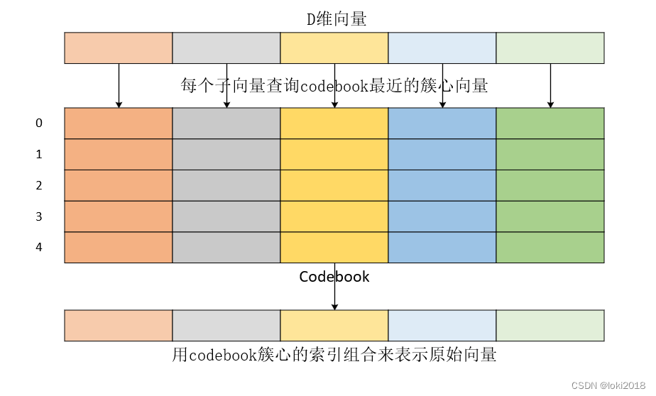
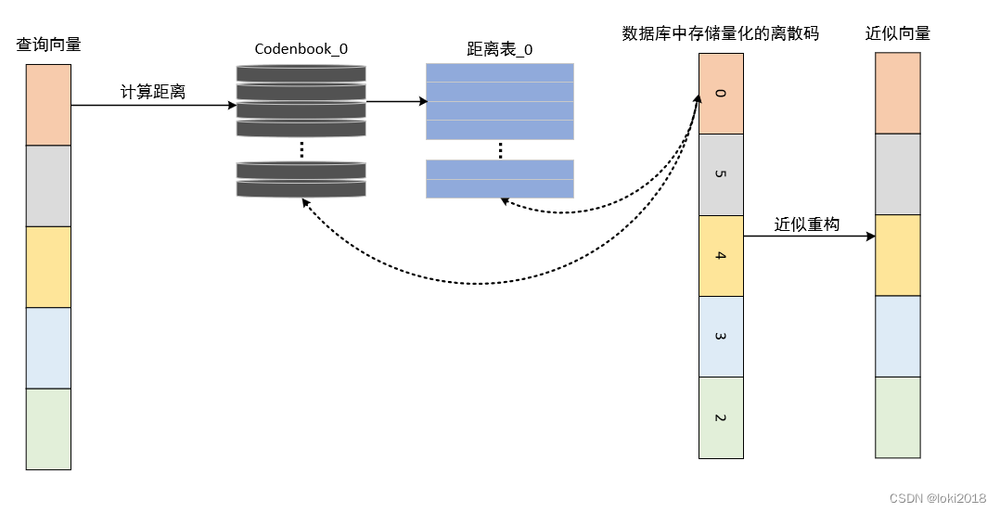

<center><strong>向量量化(vector quantization)</strong></center>

---
                        
原文链接：https://blog.csdn.net/loki2018/article/details/136907330

## 1. 向量量化与向量降维的区别
> * 首先需要搞清楚向量量化和向量降维的区别，在AI领域中，向量往往是以高维的形式存在的，每一维的元素都包含了数据的特征。例如一张图片在经过VGG16网络的计算后，输出的会是一个4096维的向量，而向量降维所研究的侧重点是如何将高维的向量转换为相对低维的向量，以提高计算效率，如下图所示。在此过程中，降维算法会去除高维向量中冗余的特征元素或者噪声，常见的算法有主成分分析（PCA）、线性判别分析（LDA）等。
> * 那么向量量化所研究的则是大规模高维向量的存储和相似性检索问题，如下图所示，它的目标是将海量的高维向量数据尽可能用相对有限的向量来进行表示，从而降低存储开销。尤其是在大数据和大语言模型时代，非结构化数据的存储和检索非常关键。最为简单的想法就是利用聚类算法对向量进行聚类，用聚类后的聚类中心向量来近似原始向量。因此，只需要存储聚类中心即可。

## 2. Product Quantization
> Jegou H, Douze M, Schmid C. Product quantization for nearest neighbor search[J]. IEEE transactions on pattern analysis and machine intelligence, 2010, 33(1): 117-128.

我们首先介绍 Product Quantization，下面简称为PQ算法，它的思想很简单，假设向量的维度为$D$，聚类中心个数为$K$，如果使用 K-means 算法，那么存储的复杂度为$K \times D$。而 PQ 算法首先将 $D$ 维向量分解为 $m$ 个子向量，每个子向量的维度为 $D^* = D / m$ , 分别对这些子向量进行聚类，将子空间中聚类中心的个数记为 $K^*$ ，那么总的聚类中心的个数 $K = (k^*)^m$ ，最后计算得到的存储复杂度为$m \times D^* \times K^* = D \times K ^{1/m} $。假设有 2048 个 128 维的聚类中心向量需要存储，通过Kmeans 计算得到的存储复杂度为 262144，而 PQ 算法只有 332。相比之下，PQ算法的性能显著地优于Kmeans。

PQ算法的详细步骤：
1. 将高维向量分解为若干子向量；
2. 分别在子向量中进行聚类，子向量空间中聚类中心的集合我们称为codebook；
3. 计算子向量与聚类中心的距离，为每个子向量分配对应的codebook索引；
4. 将子向量的索引组合起来，即可代表高维向量。



我们还可以用一段简单的代码来描述
```python
x = [1, 8, 3, 9, 1, 2, 9, 4, 5, 4, 6, 2]
m = 4  # 子向量的个数
D = len(x)  # 原始向量的维度
D_ = int(D / m)  # 子向量的维度
u = [x[row:row+D_] for row in range(0, D, D_)]  # 划分子向量
k = 256  # 总簇心个数
k_ = int(k ** (1 / m)) # 子向量的簇心个数
from random import randint
codebook = []
# 为每个子向量生成k_个簇心
for i in range(m):
    c_j = []
    for j in range(k_):
        c_ji = [randint(0, 9) for _ in range(D_)]
        c_j.append(c_ji)
    codebook.append(c_j)

def euclidean_distance(v, u):
    distance = sum((x - y) ** 2 for x, y in zip(v, u)) ** 0.5
    return distance

def nearest_cluster_center(v, codebook):
    ans = []
    for i in range(m):
        distance = 9e9
        for j in range(k_):
            d = euclidean_distance(v[i], codebook[i][j])
            if d < distance:
                distance = d
                nearest_cluster_center = j
        ans.append(nearest_cluster_center)
    return ans
quantization_code = nearest_cluster_center(u, codebook)
restore_u = []
for i, code in enumerate(quantization_code):
    restore_u.extend(codebook[i][code])

```
原始向量在量化后，用codebook中的簇心进行恢复，得到 [4, 9, 5, 4, 4, 6, 8, 3, 2, 3, 5, 3]，其结果和原始值是有出入的，因为PQ算法是一种有损压缩算法。

在使用PQ算法进行向量查询时，过程如下图所示：


这也是文章中提到的非对称距离计算，因为数据集中的向量都以量化后离散的形式进行存储，因此存储开销非常低。当有查询向量进行搜索时，查询向量也会被分割为同样数量的子向量，每个子向量在所在子空间的codebook中计算和簇心的距离，其中codebook其实也是需要被事先存储的，数据库此时会维护若干距离表。查询向量与数据库中离散的量化编码进行距离计算时，就会根据每个离散值查询距离表，距离的和就是查询向量和被查询向量的距离，也可以根据离散量化编码返回近似的向量，注意，返回的近似向量是子空间中对应簇心向量的组合，因此它和原始存储的向量是有一定差异的。