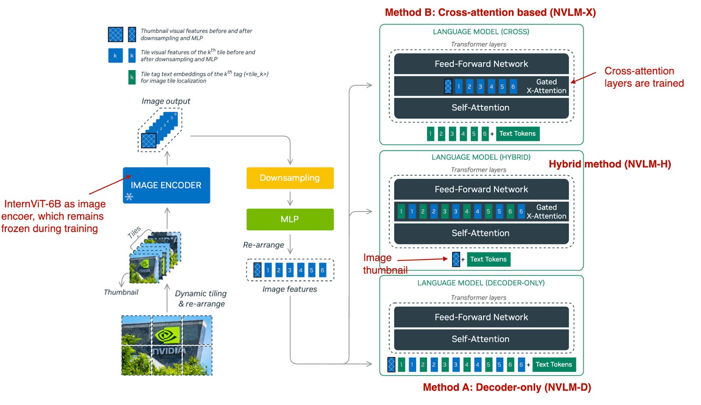
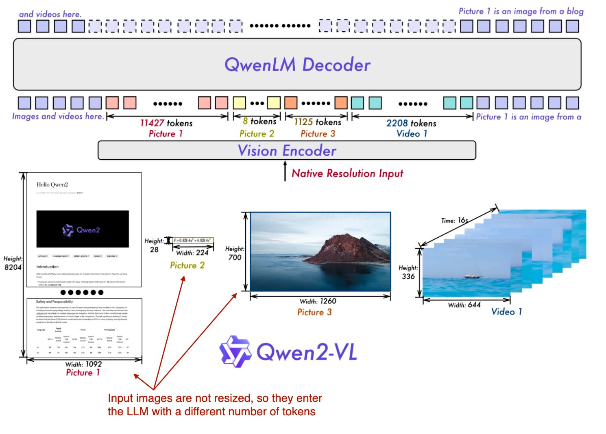
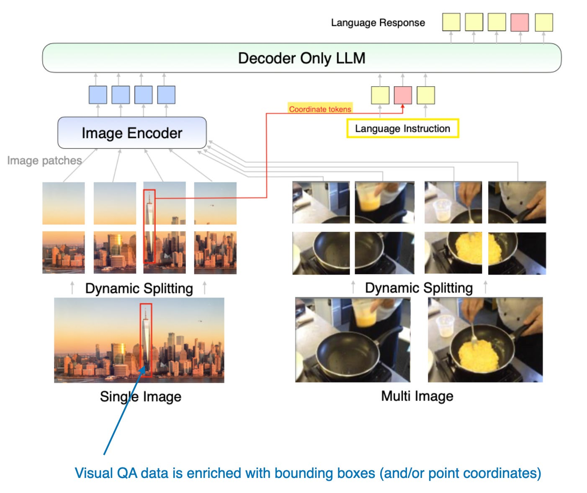
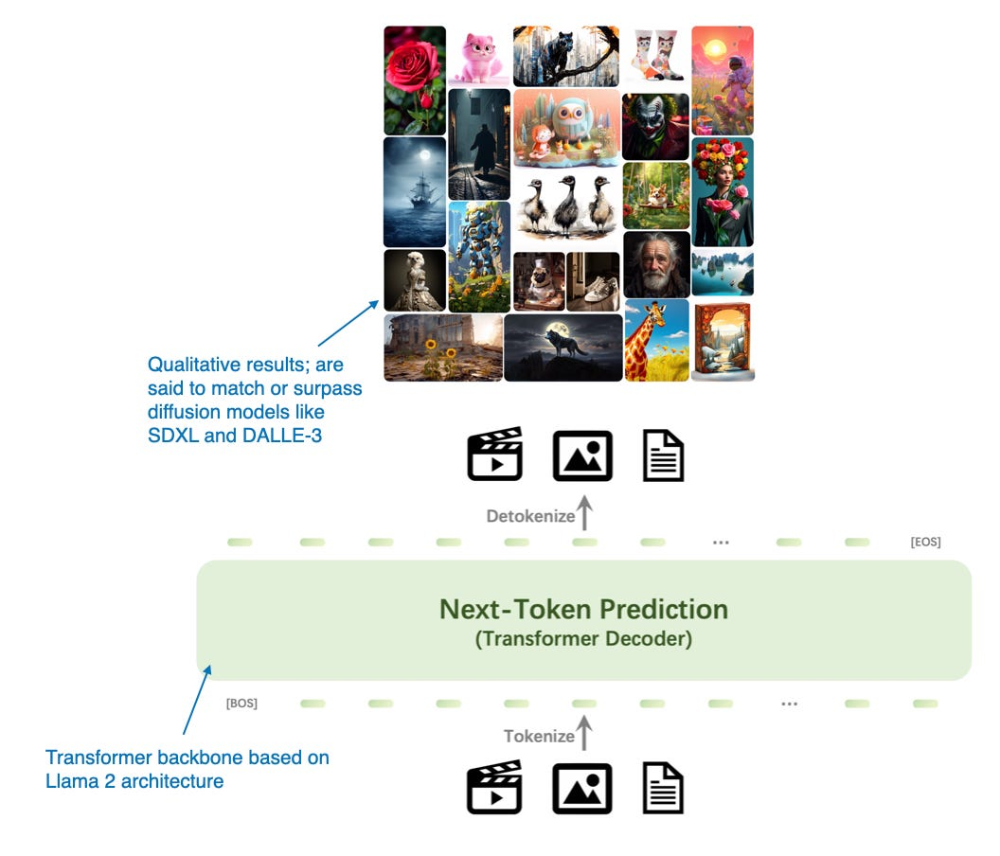
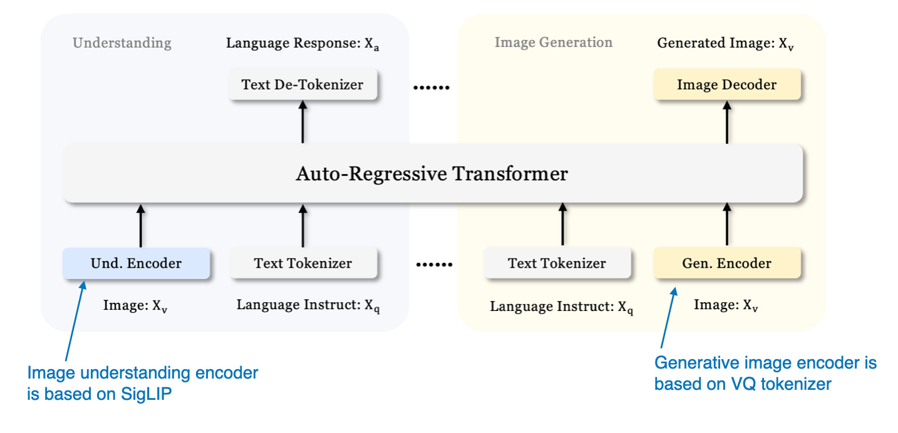
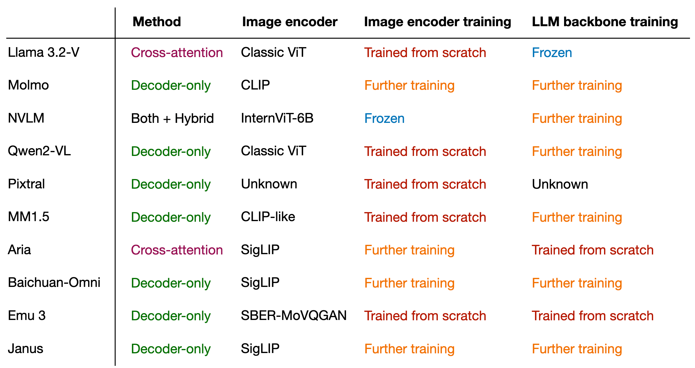

# 综述：基于LLMs的多模态大模型
## 0 概念解析

    
     
    
An illustration of a multimodal LLM that can accept different input modalities (audio, text, images, and videos) and returns text as the output modality.

什么是多模态 LLM ？正如上图中所示，多模态 LLM 是能够处理多种类型输入的大型语言模型，其中每个“模态”都是指一种特定类型的数据，例如文本（如传统 LLM）、声音、图像、视频等。

## 1 构建多模态 LLMs
### 1.1 构建多模态 LLMs 主要方法
构建多模态 LLMs 有两种主要方法：
* 方法 A：统一嵌入解码器架构方法，;（Unified Embedding Decoder Architecture approach;）更简短的描述可能是 “decoder-only”
* 方法 B：跨模态注意力架构方法。（Cross-modality Attention Architecture approach.）更简短的描述可能是 “cross-attention-based” 

    
     
    
The two main approaches to developing multimodal LLM architectures.

### 1.2 text embedding

    
     
    
Illustration of the standard process for tokenizing text and converting it into token embedding vectors, which are subsequently passed to an LLM during training and inference.

## 2.1 图像与文本分词
## 2.1 Image / text tokenization
现在，我们简要讨论了图像编码器（以及作为编码器一部分的线性投影）的用途，让我们回到前面的文本分词类比，并排查看文本和图像分词和嵌入，如下图所示。

    
     
    
图像分词化和嵌入（左）和文本分词化和嵌入（右）并排进行。

如上图所示，我提供了一个跟随图像编码器的附加投影（projector）模块。这个投影通常只是另一个线性投影层，类似于前面解释的那个。目的是将图像编码器输出投影到与嵌入文本标记的尺寸匹配的维度中，如下图所示。（正如我们稍后将看到的，投影有时也称为适配器、适配器或连接器（adapter, adaptor, or connector）。

    
     
    
图像标记化和文本标记化之间的另一个并排比较，其中投影的作用是匹配文本标记嵌入尺寸。

现在，图像patch嵌入与文本标记嵌入具有相同的嵌入维度，我们可以简单地将它们连接为 LLM 的输入，如本节开头的图所示。为了便于参考，下面再次是相同的数字。

**顺便说一句，我们在本节中讨论的 image encoder 通常是预训练的 vision transformer。一个流行的选择是 CLIP 或 OpenCLIP。但是，也有直接对patch进行操作的方法 A 版本，例如 Fuyu，如下图所示。**

    
     
    
Fuyu 多模态 LLM 的注释图，它直接在没有图像编码器的图像补丁上运行

如上图所示，Fuyu 将输入patch直接传递到线性投影（或嵌入层）中，以学习自己的图像patch嵌入，而不是像其他模型和方法那样依赖额外的预训练图像编码器。这大大简化了架构和训练设置。

## 2.2 方法 B：跨模态注意力架构

    
     
    
构建多模态 LLM 的跨模态注意力架构方法

在上图所示的跨模态注意力架构方法中，我们仍然使用我们之前讨论过的相同图像编码器设置。然而，我们不是将patch编码为 LLM 的输入，而是通过交叉注意力机制将多头注意力层中的输入patch连接起来。这个想法是相关的，可以追溯到 2017 年 Attention Is All You Need 论文中的原始 transformer 架构，如下图所示。

    
     
    
原始 transformer 架构中使用的交叉注意力机制

请注意，上图中描述的原始 “Attention Is All You Need” Transformer最初是为语言翻译而开发的。因此，它由一个 text encoder （图的左侧） 组成，它获取要翻译的句子并通过 text decoder （图的右侧） 生成翻译。在多模态 LLM 的上下文中，编码器是图像编码器而不是文本编码器，但同样的想法也适用。

交叉注意力功能如何运作？让我们看一下常规自我注意机制内部发生的事情的概念图。

    
     
    
常规自我注意机制的概述

在上图中，$x$ 是输入，$W_q$ 是用于生成查询 $(Q)$ 的权重矩阵。同样，$K$ 代表键，$V$ 代表值。$A$ 表示注意力分数矩阵，$Z$ 是转换为输出上下文向量的输入 $(x)$。

在交叉注意力中，与自我注意相反，我们有两个不同的输入源，如下图所示。

如前两个图所示，在 self-attention 中，我们使用相同的 input sequence。在交叉注意力中，我们混合或组合两个不同的输入序列。

    
     
    
交叉注意力图示，其中可以有两个不同的输入 x1 和 x2

在《Attention Is All You Need》论文中的原始Transformer架构中 ，两个输入 $x_1$ 和 $x_2$ 对应于左侧编码器模块返回的序列 $(x_2)$，右侧的解码器部分正在处理的输入序列 $(x_1)$. 在多模态 LLM 的上下文中，$x_2$ 是图像编码器的输出。

**请注意，查询通常来自解码器，键和值通常来自编码器**

请注意，在交叉注意中，两个输入序列 $x_1$ 和 $x_2$ 可以具有不同数量的元素。但是，它们的嵌入维度必须匹配。如果我们设置 $x_1 = x_2$，这相当于自我注意。

# 3 统一解码器和交叉注意力模型训练
现在我们已经讨论了两个主要的多模态设计选择，让我们简单谈谈在模型训练过程中我们如何处理这三个主要组件，如下图所示。

    
     
    
多模态 LLM 中不同组件的概述。编号为 1-3 的组件可以在多模态训练过程中冻结或解冻

与传统的纯文本 LLM 的开发类似，多模态 LLM 的训练也包括两个阶段：**预训练和教学微调**。然而，与从头开始不同的是，多模态 LLM 训练通常以预先训练的、指令微调的纯文本 LLM 作为基本模型开始。

对于图像编码器，CLIP 是常用的，并且在整个训练过程中通常保持不变，但也有例外，我们将在后面探讨。在预训练阶段保持 LLM 部分冻结也是很常见的，只专注于训练投影 - 线性层或小型多层感知器。鉴于投影机的学习能力有限，通常只包含一两层，因此 LLM 通常在多模态教学微调（第 2 阶段）期间解冻，以便进行更全面的更新。但是，**请注意，在基于交叉注意力的模型（方法 B）中，交叉注意力层在整个训练过程中都是解冻的**。

在介绍了两种主要方法（方法 A：统一嵌入解码器架构和方法 B：跨模态注意力架构）之后，你可能想知道哪种更有效。答案取决于具体的权衡。
* 统一嵌入解码器架构（方法 A）通常更容易实现，因为它不需要对 LLM 架构本身进行任何修改。
* 跨模态注意力架构（方法 B）通常被认为计算效率更高，因为它不会用额外的图像标记使输入上下文过载，而是稍后将它们引入交叉注意力层。此外，如果 LLM 参数在训练期间保持冻结，则此方法将保持原始 LLM 的纯文本性能。

我们将在后面的部分中重新讨论有关**建模性能和响应质量**的讨论，届时我们将讨论 NVIDIA 的 NVLM 论文。

这标志着对多模态 LLM 的相当广泛的介绍的结束。当我写这篇文章时，我意识到讨论已经变得比最初计划的要长，这可能使这里成为结束这篇文章的好地方。

然而，为了提供一个实用的视角，最好研究一下最近一些实现这些方法的研究论文。因此，我们将在本文的其余部分探讨这些论文。

# 4. 最新的多模态模型和方法
在本文的其余部分，我将回顾有关多模态 LLM 的最新文献，特别关注过去几周发表的作品，以保持合理的范围。

因此，这不是对多模态 LLM 的历史概述或全面回顾，而是对最新发展的简要介绍。我也会尽量保持这些摘要简短，不要有太多的绒毛，因为它们有 10 个。

本文末尾的结论部分有一个概述，比较了这些论文中使用的方法。

## 4.1 LLama 3 系列模型（The Llama 3 Herd of Models）
Meta AI 的 <u>Llama3 Herd of Models</u> 论文（2024 年 7 月 31 日）于今年夏天早些时候发布，从 LLM 的角度来看，这感觉就像是很久以前的事了。然而，鉴于他们只描述了多模态模型，但直到很久以后才发布，我认为将 Llama3 列入此列表是公平的。（Llama3.2 型号已于 9 月 25 日正式发布并上市。

多模态 Llama3.2 模型有 110 亿和 900 亿个参数版本，是使用前面描述的基于交叉注意力的方法的图像文本模型，如下图所示。

    
     
    
Llama 3.2 使用的多模态 LLM 方法的插图。（来自 Llama 3 论文的注释图：https://arxiv.org/abs/2407.21783.The 视频和语音部分在视觉上被遮挡，以将注意力集中在图像部分。

请注意，虽然该图还将视频和语音描述为可能的形式，但在撰写本文时发布的模型仅关注图像和文本。

Llama3.2 使用基于交叉注意力的方法。但是，它与我之前写的内容略有不同，即在多模态 LLM 开发中，我们通常会冻结图像编码器，只在预训练期间更新 LLM 参数。

在这里，研究人员几乎采取了相反的方法：**他们更新了图像编码器，但不更新语言模型的参数。他们写道，这是有意为之，这样做是为了保留纯文本功能，以便 11B 和 90B 多模态模型可以用作文本任务中 Llama3.1 8B 和 70B 纯文本模型的直接替代品。**

训练本身分多次迭代完成，从 Llama3.1 文本模型开始。添加图像编码器和投影（此处称为 “adapter”）层后，它们在图像文本数据上预训练模型。然后，类似于 Llama3 模型纯文本训练（我在之前的文章中写过），它们会跟进指令和偏好微调。

研究人员没有采用 CLIP 等预训练模型作为图像编码器，而是使用了他们从头开始预训练的视觉Transformer。具体来说，他们采用了经典视觉 Transformer 架构的 ViT-H/14 变体（6.3 亿个参数）（Dosovitskiy et al.， 2020）。然后，他们在 5 个 epoch 的 25 亿个图像-文本对的数据集上预训练了 ViT;这是在将图像编码器连接到 LLM 之前完成的。（图像编码器获取 224×224 分辨率的图像，并将它们划分为 14×14 个色块网格，每个色块的大小为 16×16 像素。

由于 cross-attention 层添加了大量参数，因此它们仅在每 4 个 transformer 块中添加一次。（对于 8B 模型，这增加了 3B 参数，而对于 70B 模型，这增加了 200 亿个参数。

## 4.2 Molmo 和 PixMo：用于最先进的多模态模型的开放权重和开放数据
<big><u>Molmo 和 PixMo：最先进的多模态模型的开放权重和开放数据</u></big> 论文（2024 年 9 月 25 日）值得注意，因为它承诺不仅开源模型权重，还开源类似于纯语言 OLMo LLM 的数据集和源代码。（这对于 LLM 研究非常有用，因为它允许我们查看确切的训练程序和代码，还允许我们运行消融研究并在同一数据集上重现结果。

如果你想知道为什么论文标题中有两个名字，Molmo 指的是模型（多模态开放语言模型），而 PixMo （Pixels for Molmo） 是数据集。

    
     
    
仅 Molmo 解码器方法的图示（方法 A）。注释图改编自 Molmo 和 PixMo：最先进的多模态模型的开放权重和开放数据论文：https://www.arxiv.org/abs/2409.17146。

如上图所示，图像编码器采用现成的视觉Transformer，特别是 CLIP。此处的术语“连接器”是指将图像特征与语言模型对齐的“投影”（Projector）。

Molmo 通过避免多个预训练阶段来简化训练过程，而是选择一个简单的管道，以统一的方式更新所有参数，包括基本 LLM、连接器和图像编码器的参数。

Molmo 团队为基本 LLM 提供了多种选择：
* OLMo-7B-1024（完全开放的模型主干），
* OLMoE-1B-7B（专家架构的混合体;最高效的模型），
* Qwen2 7B（性能优于 OLMo-7B-1024 的开放重量模型），
* Qwen2 72B（开放重量模型和性能最好的模型）

## 4.3 NVLM：开放 Frontier 级多模态 LLM
NVIDIA 的 <u> NVLM：Open Frontier-Class Multimodal LLMs</u> 论文（2024 年 9 月 17 日）特别有趣，因为它没有关注单一方法，而是探讨了两种方法：
* 方法 A，统一嵌入解码器架构（“仅解码器架构”，NVLM-D），以及
* 方法 B，跨模态注意力架构（“基于交叉注意力的架构”，NVLM-X）。
* 此外，他们还开发了一种混合方法 （NVLM-H），并提供了所有三种方法的同类比较。

    
     
    
NVLM 三种多模式方法概述。（注释图 NVLM：Open Frontier-Class 多模态 LLM 论文：https://arxiv.org/abs/2409.11402）

如下图所示，如前所述，NVLM-D 对应于方法 A，NVLM-X 对应于方法 B。混合模型 （NVLM-H） 背后的概念是结合两种方法的优势：提供图像缩略图作为输入，然后通过交叉注意传递动态数量的patch，以捕获更精细的高分辨率细节。简而言之，研究团队发现：
1. NVLM-X 展示了高分辨率图像的卓越计算效率。
2. NVLM-D 在 OCR 相关任务中实现了更高的准确性。
3. NVLM-H 结合了两种方法的优点。

与 Molmo 和其他方法类似，它们从纯文本 LLM 开始，而不是从头开始预训练多模态模型（因为这通常性能更好）。此外，它们使用指令调整的 LLM 而不是基本 LLM。具体来说，主干 LLM 是 Qwen2-72B-Instruct（据我所知，Molmo 使用的是 Qwen2-72B 基本模型）。

**在使用 NVLM-D 方法训练所有 LLM 参数时，他们发现对于 NVLM-X，在预训练和指令微调期间，冻结原始 LLM 参数并仅训练交叉注意力层效果很好。**

对于图像编码器，他们没有使用典型的 CLIP 模型，而是使用 InternViT-6B，该模型在所有阶段都保持冻结状态。

投影是一个多层感知器，而不是单个线性层

## 4.4 Qwen2-VL： 增强视觉语言模型在任何分辨率下对世界的感知
前两篇论文和模型 Molmo 和 NVLM 基于 Qwen2-72B LLM。在本文中，Qwen 研究团队本身宣布推出多模态 LLM，Qwen2-VL：增强视觉语言模型在任何分辨率下对世界的感知（2024 年 10 月 3 日）。

这项工作的核心是他们所谓的“Naive Dynamic Resolution”机制（“naïve”一词是有意为之，而不是“native”的拼写错误，尽管“native”也可能很合适）。这种机制允许模型处理不同分辨率的图像，而无需简单的缩减像素采样，从而能够以原始分辨率输入图像。

    
     
    
多模态 Qwen 模型概述，该模型可以原生处理各种不同分辨率的输入图像。（注释图 Qwen2-VL 论文：https://arxiv.org/abs/2409.12191）

原生分辨率输入是通过修改后的 ViT 实现的，通过删除原始的绝对位置嵌入并引入 **2D-RoPE。**

他们使用了具有 675M 参数和不同大小的 LLM 主干的经典视觉编码器，如下表所示。

    
     
    
多模态 Qwen 模型概述，该模型可以原生处理各种不同分辨率的输入图像。（注释图 Qwen2-VL 论文：https://arxiv.org/abs/2409.12191）

训练本身包括 3 个阶段：
1. 仅预训练图像编码器，
2. 解冻所有参数（包括 LLM）
3. 冻结图像编码器并仅对 LLM 进行指令微调。

## 4.5 Pixtral 12B
Pixtral 12B（2024 年 9 月 17 日）采用方法 A：统一嵌入解码器架构方法，是 Mistral AI 的第一个多模态模型。遗憾的是，没有可用的技术论文或报告，但 Mistral 团队在他们的博客文章中分享了一些有趣的花絮。

有趣的是，他们选择不使用预训练的图像编码器，而是从头开始训练具有 4 亿个参数的图像编码器。对于 LLM 主干，他们使用了 120 亿个参数的 Mistral NeMo 模型。

与 Qwen2-VL 类似，Pixtral 也原生支持可变图像大小，如下图所示。

    
     
    
Pixtral 如何处理不同大小图像的插图。（来自 Pixtral 博客文章的注释图：https://mistral.ai/news/pixtral-12b/）

## 4.6 MM1.5：多模式LLM微调的方法、分析和洞察
<u>MM1.5:来自多模态LLM微调的方法、分析和洞察</u>（2024年9月30日）提供了实用技巧，并介绍了一个专家混合的多模态模型和一个类似于Molmo的密集模型。这些模型涵盖 10 亿到 300 亿个参数的广泛尺寸范围。

本文中描述的模型侧重于方法 A，这是一种统一嵌入 Transformer 架构，它有效地构建了多模态学习的输入。

此外，本文还进行了**一系列有趣的消融研究**，研究了数据混合和使用坐标标记的效果。

    
     
    
MM1.5 方法的图示，其中包括用于表示边界框的其他坐标标记。（注释图来自 MM1.5 论文：https://arxiv.org/abs/2409.20566。

## 4.9 EMU3：只需 Next-Token 预测
<u>Emu3：Next-Token Prediction is All You Need</u> 论文（2024 年 9 月 27 日）提出了一种引人注目的图像生成扩散模型的替代方案，该模型完全基于基于 transformer 的解码器架构。虽然它不是传统意义上的多模态 LLM（即专注于图像理解而不是生成的模型），但 Emu3 非常有趣，因为 **它证明了可以使用 transformer 解码器进行图像生成，这是一项通常由扩散方法主导的任务。**（但是，请注意，之前还有其他类似的方法，例如 **自回归模型击败扩散：Llama 用于可扩展图像生成。**

    
     
    
Emu3 主要是用于图像生成的 LLM，作为扩散模型的替代方案。（注释图 Emu3 论文：https://arxiv.org/abs/2409.18869）

研究人员从头开始训练 Emu3，然后使用**直接偏好优化(Direct Preference Optimization, DPO)** 使模型与人类偏好保持一致。

该架构包括一个受 SBER-MoVQGAN 启发的**视觉分词器**。核心 LLM 架构基于 Llama 2，但它完全是从头开始训练的。

## 4.10 Janus：解耦视觉编码以实现统一的多模态理解和生成
我们之前专注于用于图像理解的多模态 LLM，只看到了上面使用 Emu 3 生成图像的一个示例。现在，Janus：解耦统一多模态理解和生成的视觉编码论文（2024 年 10 月 17 日）介绍了一个框架，该框架将多模态理解和生成任务统一到单个 LLM 主干中。

Janus 的一个关键特征是视觉编码途径的解耦，以满足理解和生成任务的不同要求。研究人员认为，图像理解任务需要高维语义表示，而生成任务需要详细的局部信息和图像的全局一致性。通过分离这些途径，Janus 有效地管理了这些不同的需求。

该模型采用 SigLIP 视觉编码器，类似于 Baichuan-Omni 中使用的编码器，用于处理视觉输入。对于图像生成，它利用矢量量化 （VQ） 分词器来处理生成过程。Janus 中的基本 LLM 是 具有 13 亿个参数的 DeepSeek-LLM。

    
     
    
Janus 中使用的统一仅解码器框架概述。（注释图 来自 Janus 论文：https://arxiv.org/abs/2410.13848。

此图中模型的训练过程遵循三个阶段，如下图所示。

    
     
    
Janus 模型的 3 阶段训练过程图示。（注释图 来自 Janus 论文：https://arxiv.org/abs/2410.13848）

* 在第一阶段，只有投影层和图像输出层被训练，而 LLM、理解和生成编码器保持冻结；
* 在第二阶段，LLM 主干和文本输出层被解冻，允许在理解和生成任务之间进行统一的预训练；
* 在第三阶段，整个模型（包括 SigLIP 图像编码器）被解冻以进行监督微调，使模型能够完全集成和优化其多模态功能。

# 结论
您可能已经注意到，我几乎完全跳过了建模和计算性能比较。首先，由于普遍存在数据污染，在公共基准测试中比较 LLM 和多模态 LLM 的性能具有挑战性，这意味着测试数据可能已包含在训练数据中。

此外，架构组件差异很大，以至于很难进行同类比较。因此，非常感谢 NVIDIA 团队以不同的风格开发 NVLM，这至少允许比较仅解码器和交叉注意力方法。

无论如何，本文的主要收获是，可以通过许多不同的方式成功构建多模态 LLM。下图总结了本文中介绍的模型的不同组件。

    
     
    
本文涵盖的不同模型及其子组件和训练方法的概述。

我希望您阅读本文时发现有教育意义，现在对多模态 LLM 的工作原理有了更好的了解！原文地址：https://magazine.sebastianraschka.com/p/understanding-multimodal-llms 翻译的时候有小的调整和优化。

# 参考资料
* [Understanding Multimodal LLMs](https://magazine.sebastianraschka.com/p/understanding-multimodal-llms)